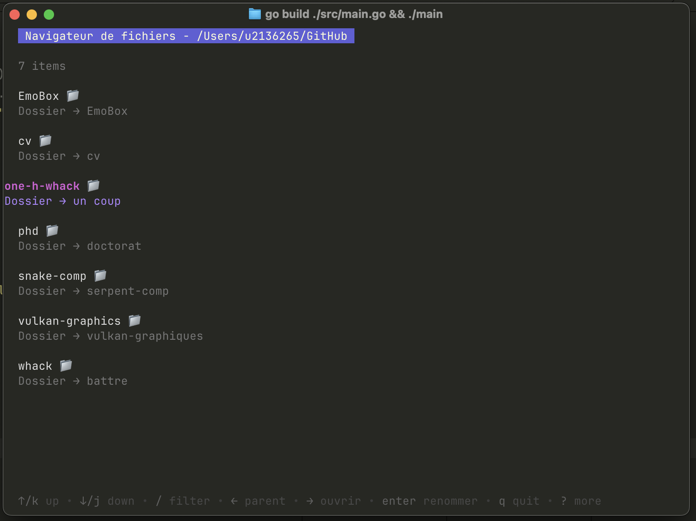
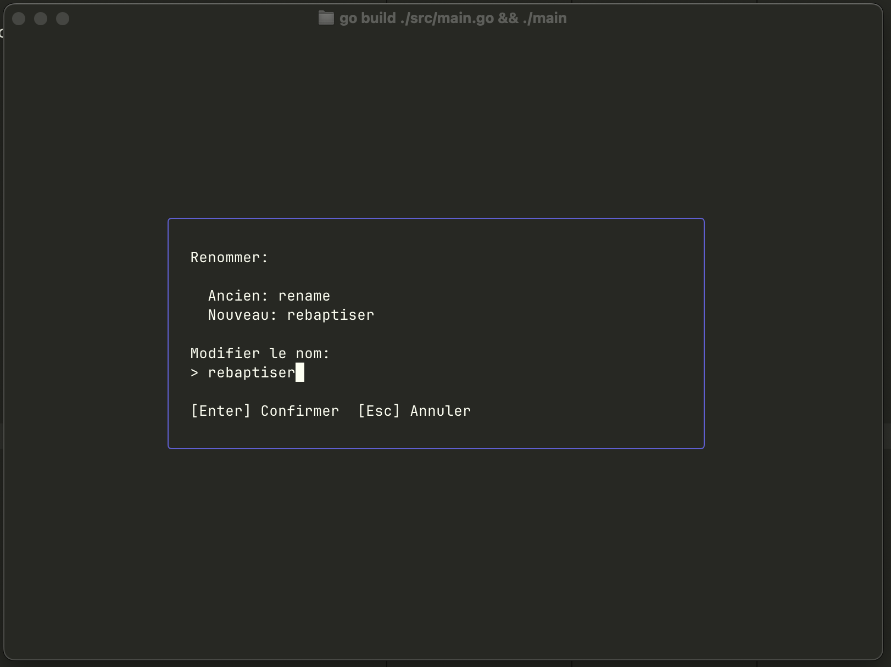

# one-h-whack

A tool for renaming your files to French. I do not know why you would want to do
this.

I do not know French.

## Setup

Download go 1.25.1.

Run:

`go mod tidy`
`go build ./src/main.go && ./main`

I recommend only running this on the `./test` files.

## Example Figures

